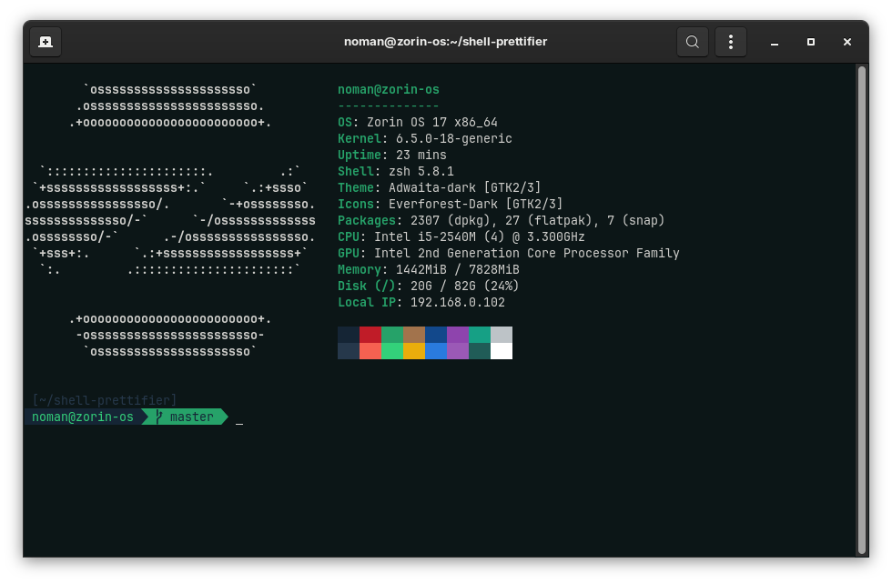

# shell-prettifier.sh

_**Shell Prettifier is a simple script that beautifies your terminal with oh-my-zsh and zsh plugins in gnome-desktop-environment.**_



## Installation

**_To install Shell Prettifier, run the following commands:_**

_Clone the repository:_

```bash
git clone --depth 1 https://github.com/8gudbits/shell-prettifier.git
```

_Move to 'shell-prettifier/':_

```bash
cd shell-prettifier/
```

_Install required packages:_

```bash
sudo chmod +x install_requirements.sh
```

```bash
./install_requirements.sh
```

_Install terminal profile:_

```bash
sudo chmod +x install_profile.sh
```

```bash
./install_profile.sh
```

_If the terminal doesn't switch to zsh run this:_

```bash
chsh -s $(which zsh)
```

**_Requires reboot for the changes to take effect._**

**Note:** _Tested on "Zorin OS 17" and "Ubuntu 22.04 LTS"._

**Tip 1:** _To disable neofetch from launching with the terminal, you can modify the file `~/.zshrc` and comment out the last line from the file and save it._

**Tip 2:** _Keep the terminal profile backup file that will be created by `install_profile.sh` script incase you want to revert to your old terminal settings._

**Tip 3:** _You can use the wallpaper from `.shell-prettifier/wallpaper/` to match the color palette._

## Fixing font

_If you are having issues where special characters and icons are not displayed correctly, I recommend downloading another fixed version of the font instead._

_Here is how you can install Menlo-for-Powerline font:_

```bash
git clone https://github.com/abertsch/Menlo-for-Powerline.git
```

_After downloading you can add the font to your fonts folder:_

```bash
cd Menlo-for-Powerline
cp "Menlo for Powerline.ttf" ~/.fonts
```

_Lastly, you will need to select the font in your terminals preferences/settings._

## How to reset

_If you want to revert to your old terminal settings, you can load the backup that was made by the `install_profile.sh` script while installing using this command:_

```bash
dconf load /org/gnome/terminal/legacy/profiles:/ < ~/terminal_profile_backup.dconf
```

_Then, you can reset your shell back to bash with the following command:_

```bash
chsh -s $(which bash)
```

_Now you can remove the packages that were installed by the script, the packages are:_

```bash
pv git git-core zsh neofetch curl
```

## Sources

|                            [Robby Russel OMZ](https://github.com/robbyrussel/oh-my-zsh)                             |
| :-----------------------------------------------------------------------------------------------------------------: |
| [Oh My Zsh guide!](https://medium.com/wearetheledger/oh-my-zsh-made-for-cli-lovers-installation-guide-3131ca5491fb) |
|                     [Syntax Highlighting](https://github.com/zsh-users/zsh-syntax-highlighting)                     |
|                        [Auto Suggestions](https://github.com/zsh-users/zsh-autosuggestions)                         |
|                                  [Agnoster Theme](https://gist.github.com/3712874)                                  |
